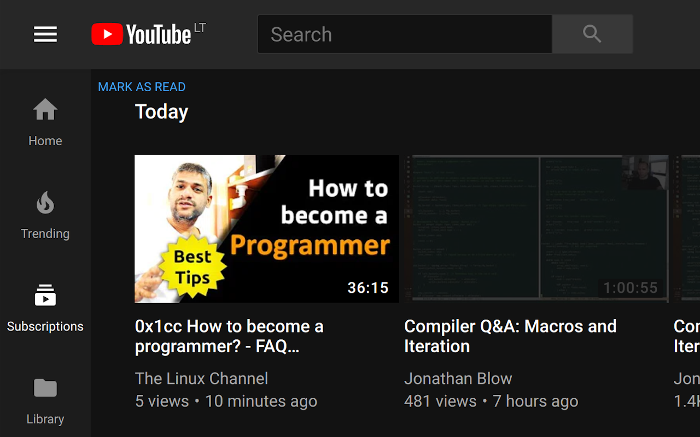

This plugin helps track read content of subscriptions.
It works best if you are using subscriptions to put new videos to **watch later** list.
This plugin works differently from other plugins, because it does not use YouTube API to hide videos.
Read videos are sync between browsers.
It works like marking ar read by timestamp rather than concrete videos in the list. 

Some quirks:

- Sometimes plugin does not recocnise page. For such cases page refresh should help.
- Plugin uses ~10 videos as marker to know boundary for new and old content:
  - If you remove subscriptions, you may lose all marked videos. In sush case plugin shows all videos as new.
  - If you subscribe more channels, then all older videos from this new channel are marked as read as well. 

